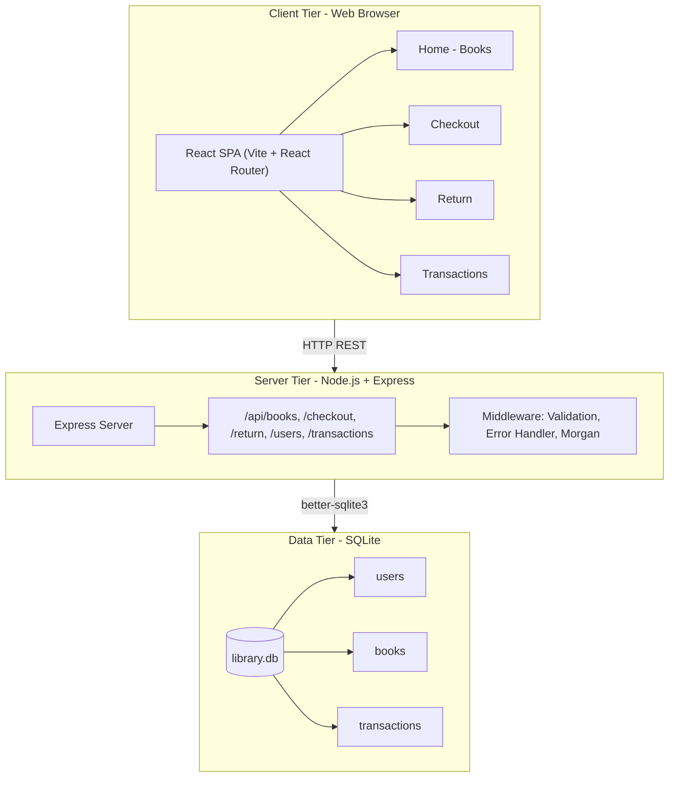

# Library Management System

A full-stack web application for managing library book checkouts and returns. Built with React (frontend) and Node.js/Express (backend), backed by a SQLite database.

---

## Table of Contents

- [System Architecture](#system-architecture)
- [Functional Requirements](#functional-requirements)
- [Non-Functional Requirements](#non-functional-requirements)
- [High-Level Design Diagram](#high-level-design-diagram)
- [Technologies Used](#technologies-used)
- [Data Models](#data-models)
- [API Endpoints](#api-endpoints)
- [State Management](#state-management)
- [Performance Considerations](#performance-considerations)
- [Getting Started](#getting-started)
- [Running Tests](#running-tests)
- [Project Structure](#project-structure)
- [Assumptions](#assumptions)
- [Future Improvements](#future-improvements)

---

## System Architecture

### High-Level Architecture Diagram

```
                ┌──────────────────────────┐
                │        Web Browser        │
                │  React SPA (Vite)        │
                │                          │
                │  Pages                   │
                │  • Home (Books)          │
                │  • Checkout              │
                │  • Return                │
                │  • Transactions          │
                └─────────────┬────────────┘
                              │
                              │ HTTP / REST
                              ▼
                ┌──────────────────────────┐
                │     Node.js Backend      │
                │      Express Server      │
                │                          │
                │  API Routes              │
                │  • /api/books            │
                │  • /api/checkout         │
                │  • /api/return           │
                │  • /api/users            │
                │  • /api/transactions     │
                │                          │
                │  Middleware              │
                │  • Validation            │
                │  • Error Handling        │
                │  • Logging               │
                └─────────────┬────────────┘
                              │
                              │ Database Driver
                              ▼
                ┌──────────────────────────┐
                │       SQLite Database     │
                │                          │
                │ Tables                   │
                │ • users                  │
                │ • books                  │
                │ • transactions           │
                └──────────────────────────┘
```

The frontend is a single-page application served on port 3000 during development, with all `/api/*` requests proxied to the Express backend on port 5000. In production, both can be served from the same origin by serving the Vite build output via Express.

---

## Functional Requirements

The system supports the following core functional capabilities:

### Book Management

- View a paginated catalog of books.
- Search books by title.
- Filter books by genre.
- View detailed information about a book.

### User Management

- View existing users.
- Create new users.

### Checkout & Return

- Check out a book for a specific user.
- Prevent checkout when no copies are available.
- Prevent duplicate checkout of the same book by the same user.
- Return a book and update its availability.

### Transaction Management

- Track checkout history.
- View active and returned transactions.
- Filter transactions by user and status.

### Recommendations (Enhancement)

- Suggest similar books based on genre.

---

## Non-Functional Requirements

### Performance

- Pagination prevents large datasets from being returned in a single request.
- Indexed database columns ensure efficient lookups.

### Reliability

- Database constraints enforce data integrity.
- Atomic transactions prevent race conditions during checkout/return operations.

### Scalability

- Backend APIs are stateless and can be horizontally scaled.
- The architecture can easily migrate from SQLite to PostgreSQL for production workloads.

### Security

- Input validation using express-validator.
- SQL injection prevented through parameterized queries.

### Maintainability

- Modular project structure (routes, middleware, services).
- Clear separation between frontend and backend.

### Observability

- HTTP request logging implemented with Morgan.

---

## High-Level Design Diagram

The following diagram illustrates the system architecture in a layered view. It renders automatically on GitHub.



> **Note:** This Mermaid diagram renders on GitHub, GitLab, and most markdown viewers. For a draw.io-style editor, you can recreate it at [draw.io](https://app.diagrams.net/) and export as PNG/SVG to add as an image.

---

## Technologies Used

| Layer       | Technology                          | Reason                                               |
|-------------|-------------------------------------|------------------------------------------------------|
| Frontend    | React 19 + Vite                     | Fast DX, component model, wide ecosystem             |
| Routing     | React Router v6                     | Declarative, nested routes, history API              |
| Server state| TanStack Query (React Query) v5     | Caching, background refetch, deduplication (see below)|
| HTTP client | Axios                               | Interceptors, consistent error handling              |
| Backend     | Node.js + Express                   | Lightweight, non-blocking I/O, huge ecosystem        |
| Validation  | express-validator                   | Composable middleware-based validation               |
| Database    | SQLite via better-sqlite3           | Zero-config, file-based, synchronous API (see below) |
| Logging     | Morgan                              | HTTP request logging in development                  |
| Testing (FE)| Vitest + Testing Library + MSW      | Fast, Vite-native, browser-like DOM testing          |
| Testing (BE)| Jest + Supertest                    | Mature, rich assertion API, HTTP integration tests   |

---

## Database Choice: SQLite

**Why SQLite?**

SQLite was chosen for this project for the following reasons:

1. **Zero external dependencies** — no database server to install, configure or keep running. The entire database lives in a single `library.db` file.
2. **Simplicity for local development** — reviewers can clone and run the project with `npm install` and `npm start`, with no Docker or external service required.
3. **`better-sqlite3`** provides a synchronous API that integrates naturally with Express's synchronous request handlers, making transactions straightforward.
4. **WAL mode** (`PRAGMA journal_mode = WAL`) is enabled, which allows concurrent reads alongside writes — adequate for a library system's workload.

> **Production note:** For a production deployment handling hundreds of concurrent users, a client-server database like **PostgreSQL** would be preferable. The data models and queries used here translate directly to PostgreSQL with minimal changes.

**Schema:**

```sql
CREATE TABLE users (
  id          INTEGER PRIMARY KEY AUTOINCREMENT,
  name        TEXT    NOT NULL,
  email       TEXT    UNIQUE NOT NULL,
  created_at  DATETIME DEFAULT CURRENT_TIMESTAMP
);

CREATE TABLE books (
  id                INTEGER PRIMARY KEY AUTOINCREMENT,
  title             TEXT    NOT NULL,
  author            TEXT    NOT NULL,
  isbn              TEXT    UNIQUE NOT NULL,
  genre             TEXT    NOT NULL,
  published_year    INTEGER,
  total_copies      INTEGER NOT NULL DEFAULT 1,
  available_copies  INTEGER NOT NULL DEFAULT 1,
  created_at        DATETIME DEFAULT CURRENT_TIMESTAMP,
  CHECK (available_copies >= 0),
  CHECK (available_copies <= total_copies)
);

CREATE TABLE transactions (
  id             INTEGER PRIMARY KEY AUTOINCREMENT,
  book_id        INTEGER NOT NULL REFERENCES books(id),
  user_id        INTEGER NOT NULL REFERENCES users(id),
  checkout_date  DATETIME DEFAULT CURRENT_TIMESTAMP,
  due_date       DATETIME NOT NULL,
  return_date    DATETIME,
  status         TEXT NOT NULL DEFAULT 'active'
                   CHECK(status IN ('active', 'returned', 'overdue'))
);
```

---

## Data Models

### User

| Field        | Type     | Description                       |
|--------------|----------|-----------------------------------|
| `id`         | integer  | Primary key                       |
| `name`       | string   | Full name                         |
| `email`      | string   | Unique email address              |
| `created_at` | datetime | Registration timestamp            |

### Book

| Field              | Type     | Description                               |
|--------------------|----------|-------------------------------------------|
| `id`               | integer  | Primary key                               |
| `title`            | string   | Book title                                |
| `author`           | string   | Author name                               |
| `isbn`             | string   | Unique ISBN                               |
| `genre`            | string   | Genre category                            |
| `published_year`   | integer  | Year of publication                       |
| `total_copies`     | integer  | Total copies owned by the library         |
| `available_copies` | integer  | Copies currently available for checkout  |

### Transaction

| Field           | Type     | Description                                          |
|-----------------|----------|------------------------------------------------------|
| `id`            | integer  | Primary key                                          |
| `book_id`       | integer  | FK → books                                           |
| `user_id`       | integer  | FK → users                                           |
| `checkout_date` | datetime | When the book was checked out                        |
| `due_date`      | datetime | Return deadline (checkout date + 14 days)           |
| `return_date`   | datetime | Actual return date (null while active)              |
| `status`        | string   | `active` / `returned` / `overdue`                   |

---

## API Endpoints

### Books

| Method | Path                | Description                                      |
|--------|---------------------|--------------------------------------------------|
| GET    | `/api/books`        | List books (supports `page`, `limit`, `search`, `genre`, `available` query params) |
| GET    | `/api/books/genres` | List all distinct genres                         |
| GET    | `/api/books/:id`    | Get a single book by ID                          |

### Transactions

| Method | Path               | Description                                                  |
|--------|--------------------|--------------------------------------------------------------|
| POST   | `/api/checkout`    | Check out a book. Body: `{ book_id, user_id }`               |
| POST   | `/api/return`      | Return a book. Body: `{ transaction_id }`                    |
| GET    | `/api/transactions`| List transactions. Supports `user_id`, `status` query params|

### Users

| Method | Path          | Description                                    |
|--------|---------------|------------------------------------------------|
| GET    | `/api/users`  | List all users                                 |
| POST   | `/api/users`  | Create a user. Body: `{ name, email }`         |

### Health

| Method | Path          | Description          |
|--------|---------------|----------------------|
| GET    | `/api/health` | Health check         |

**Checkout response example:**

```json
{
  "message": "Book checked out successfully",
  "transaction": {
    "id": 3,
    "book_id": 1,
    "user_id": 2,
    "status": "active",
    "checkout_date": "2026-03-05T10:00:00.000Z",
    "due_date": "2026-03-19T10:00:00.000Z",
    "return_date": null,
    "book_title": "The Great Gatsby",
    "user_name": "Alice Johnson",
    "user_email": "alice@example.com"
  }
}
```

---

## State Management

**TanStack Query (React Query)** was chosen for server state management. Here's the rationale:

### Why TanStack Query over Redux or Context API?

| Concern                   | TanStack Query                                       | Redux / Context                              |
|---------------------------|------------------------------------------------------|----------------------------------------------|
| Remote data fetching      | First-class: caching, refetching, pagination         | Manual, requires additional middleware       |
| Loading / error states    | Built-in per-query                                   | Manual boilerplate                           |
| Cache invalidation        | `queryClient.invalidateQueries(key)` after mutation  | Manual action dispatch + reducer logic       |
| Background refresh        | Automatic stale-while-revalidate                     | Not included                                 |
| Optimistic updates        | Supported natively                                   | Complex to implement                         |
| Bundle size               | ~13 KB gzipped                                       | Redux Toolkit ~11 KB, but needs more setup   |

The application's state is almost entirely **server state** (books, users, transactions fetched from the API). TanStack Query is purpose-built for this pattern. Local UI state (form fields, filter values, modal open/close) is managed with React's built-in `useState` hook — this avoids the overhead of a global store for transient UI concerns.

**Key implementation details:**
- `staleTime` is configured per-query so that book/genre lists are cached for 30 seconds and user lists for 60 seconds, reducing redundant network requests during a session.
- After a successful checkout or return mutation, `queryClient.invalidateQueries` is called on the `books` and `transactions` query keys, ensuring the UI reflects the updated availability instantly.

---

## Performance Considerations

### Backend

1. **Database indexes** — Indexes on `transactions.book_id`, `transactions.user_id`, `transactions.status`, and `books.available_copies` ensure that the most common queries (filter by status, look up a user's transactions) are O(log n) rather than full table scans.

2. **SQLite WAL mode** — Write-Ahead Logging allows concurrent reads while a write is in progress, preventing read starvation under moderate concurrency.

3. **Atomic transactions** — Checkout and return operations wrap the `SELECT` + `UPDATE` logic in a single SQLite transaction. This prevents race conditions where two requests could simultaneously read `available_copies = 1`, both decide the book is available, and both decrement — resulting in a negative value. The `CHECK (available_copies >= 0)` constraint acts as a final safety net.

4. **Pagination** — `GET /api/books` is paginated with configurable `page` and `limit` parameters (default 12, max 100), preventing the server from returning unbounded result sets.

5. **Input validation** — All request inputs are validated with `express-validator` before any database query is executed, avoiding unnecessary DB load from malformed requests.

### Frontend

1. **TanStack Query caching** — Avoids redundant API calls for data that hasn't changed. `keepPreviousData: true` prevents layout shifts when paginating.

2. **Vite** — Native ES module bundling with extremely fast HMR during development and efficient tree-shaking for production builds.

---

## Getting Started

### Prerequisites

- **Node.js** v18+ (v20 recommended)
- **npm** v9+
- No database server required — SQLite is embedded

### 1. Clone the repository

```bash
git clone https://github.com/your-username/library-management-system.git
cd library-management-system
```

### 2. Install dependencies

```bash
# Backend
cd backend
npm install

# Frontend
cd ../frontend
npm install
```

### 3. Start the backend

```bash
cd backend
npm run dev
# API available at http://localhost:5000
# The SQLite database is created automatically at backend/data/library.db
# Seed data (12 books, 5 users) is inserted on first run
```

### 4. Start the frontend

Open a new terminal:

```bash
cd frontend
npm run dev
# App available at http://localhost:3000
```

### 5. Open the app

Navigate to [http://localhost:3000](http://localhost:3000) in your browser.

---

## Running Tests

### Backend tests (Jest + Supertest)

```bash
cd backend
npm test              # run all tests
npm run test:coverage # run with coverage report
```

**31 tests** covering:
- `GET /api/books` — pagination, genre filter, search filter, availability filter
- `GET /api/books/:id` — found / not found / invalid id
- `GET /api/books/genres`
- `POST /api/checkout` — success, no copies, user already has book, book not found, user not found, validation errors
- `POST /api/return` — success, already returned, not found, validation errors
- `GET /api/transactions` — list, filter by user, filter by status
- `GET /api/users` — list, no sensitive fields
- `POST /api/users` — create, duplicate email, invalid email, missing name

### Frontend tests (Vitest + Testing Library + MSW)

```bash
cd frontend
npm test              # run all tests
npm run test:coverage # run with coverage report
```

**42 tests** covering:
- `Alert` — all variant classes, dismiss handler
- `Spinner` — renders with aria-label
- `BookCard` — title/author, availability badges, genre, checkout link
- `Pagination` — page buttons, active state, prev/next disable, onPageChange callback
- `HomePage` — title, loading state, books list, genre filter, search, empty state
- `CheckoutPage` — form renders, validation errors, book details preview, successful submission, query param pre-selection
- `ReturnPage` — form renders, validation errors, transaction details, successful return
- `TransactionsPage` — table data, user/status filters, badges

---

## Project Structure

```
library-management-system/
├── backend/
│   ├── src/
│   │   ├── app.js              # Express app (routes, middleware)
│   │   ├── server.js           # HTTP server entry point
│   │   ├── database.js         # SQLite connection, schema, seed
│   │   ├── routes/
│   │   │   ├── books.js        # GET /api/books, /api/books/genres, /api/books/:id
│   │   │   ├── transactions.js # POST /api/checkout, POST /api/return, GET /api/transactions
│   │   │   └── users.js        # GET /api/users, POST /api/users
│   │   └── middleware/
│   │       └── errorHandler.js # 404 + 500 handlers
│   ├── tests/
│   │   ├── books.test.js
│   │   ├── transactions.test.js
│   │   └── users.test.js
│   ├── data/                   # SQLite .db file (git-ignored)
│   └── package.json
│
├── frontend/
│   ├── src/
│   │   ├── api/
│   │   │   └── client.js       # Axios instance + API functions
│   │   ├── components/
│   │   │   ├── Alert.jsx
│   │   │   ├── BookCard.jsx
│   │   │   ├── Navbar.jsx
│   │   │   ├── Pagination.jsx
│   │   │   └── Spinner.jsx
│   │   ├── pages/
│   │   │   ├── HomePage.jsx
│   │   │   ├── CheckoutPage.jsx
│   │   │   ├── ReturnPage.jsx
│   │   │   └── TransactionsPage.jsx
│   │   ├── test/
│   │   │   ├── setup.js        # jest-dom + MSW server
│   │   │   ├── handlers.js     # MSW request handlers (mock API)
│   │   │   ├── components.test.jsx
│   │   │   ├── HomePage.test.jsx
│   │   │   ├── CheckoutPage.test.jsx
│   │   │   ├── ReturnPage.test.jsx
│   │   │   └── TransactionsPage.test.jsx
│   │   ├── App.jsx
│   │   ├── main.jsx
│   │   └── index.css
│   ├── vite.config.js
│   └── package.json
│
└── README.md
```

---

## Assumptions

1. **Authentication is out of scope.** Users are selected from a dropdown rather than authenticated. In a production system, users would log in with JWT/session-based auth.

2. **Loan period is fixed at 14 days.** The due date is always `checkout_date + 14 days`. This is a constant (`LOAN_PERIOD_DAYS`) in the backend and could be made configurable per user tier.

3. **One active checkout per (user, book) pair.** A user cannot check out two copies of the same book simultaneously. This is enforced at the API level.

4. **Books are pre-seeded.** The library catalog is seeded with 12 books and 5 users on first start. A full admin interface for adding/editing books was considered out of scope for this exercise.

5. **`available_copies` is denormalized.** Rather than computing availability by counting active transactions on every query, we store `available_copies` on the `books` table and update it atomically during checkout/return. This trades a small risk of drift (mitigated by atomic transactions) for dramatically faster read performance.

6. **SQLite is appropriate for this context.** A production multi-server deployment would use PostgreSQL, but SQLite is fully functional and appropriate for a local demonstration and single-server deployments.

---

## Future Improvements

- **Authentication and authorization** — JWT or session-based login for patrons and librarians
- **Replace SQLite with PostgreSQL** — For production deployments with concurrent users
- **Containerization using Docker** — Docker Compose to run frontend, backend, and database as containers
- **CI/CD pipeline** — GitHub Actions for automated tests, linting, and deployments
